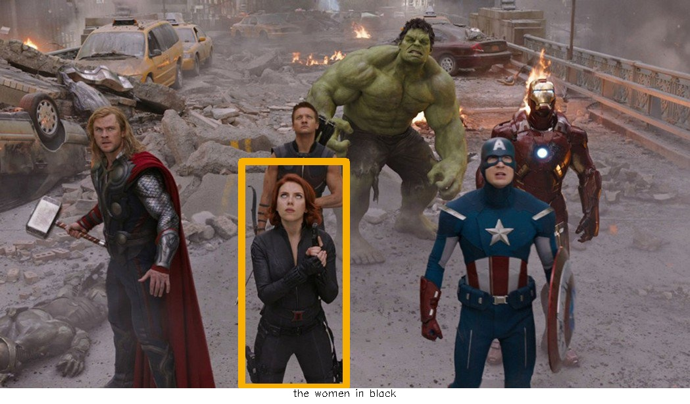

# LBYL-Net


This repo implements paper [*Look Before You Leap: Learning Landmark Features For One-Stage Visual Grounding*](https://arxiv.org/abs/2104.04386) CVPR 2021. 

<image src="imgs/landmarks.png" width="512">

The core of this paper is [Landmark Convolution](https://github.com/hbb1/landmarkconv).
-----------
### Getting Started
#### Prerequisites
- python 3.7
- pytorch 10.0
- cuda 10.0 
- gcc 4.92 or above

#### Installation
1. Then clone the repo and install dependencies.
    ```bash
    git clone https://github.com/svip-lab/LBYLNet.git
    cd LBYLNet
    pip install requirements.txt 
    ```
2. You also need to install our landmark feature convolution:
    ```bash
    cd ext
    git clone https://github.com/hbb1/landmarkconv.git
    cd landmarkconv/lib/layers
    python setup.py install --user
    ```
3. We follow dataset structure [DMS](https://github.com/BCV-Uniandes/DMS) and [FAOA](https://github.com/zyang-ur/onestage_grounding). For convience, we have pack them togather, including ReferitGame, RefCOCO, RefCOCO+, RefCOCOg.
    ```bash
    bash data/refer/download_data.sh ./data/refer
    ```
4. download the generated index files and place them in `./data/refer`. Available at [[Gdrive]](https://drive.google.com/open?id=1cZI562MABLtAzM6YU4WmKPFFguuVr0lZ), [[One Drive]](https://uofr-my.sharepoint.com/:f:/g/personal/zyang39_ur_rochester_edu/Epw5WQ_mJ-tOlAbK5LxsnrsBElWwvNdU7aus0UIzWtwgKQ?e=XHQm7F)
.
5. download the pretained model of YOLOv3. 
    ```bash
    wget -P ext https://pjreddie.com/media/files/yolov3.weights
    ```
-----------
### Training and Evaluation
By default, we use 2 gpus and batchsize 64 with DDP (distributed data-parallel). 
We have provided several configurations and training log for reproducing our results. If you want to use different hyperparameters or models, you may create configs for yourself. Here are examples:
- For distributed training with gpus : 
    ```bash
    CUDA_VISIBLE_DEVICES=0,1 python train.py lbyl_lstm_referit_batch64  --workers 8 --distributed --world_size 1  --dist_url "tcp://127.0.0.1:60006"
    ```
- If you use single gpu or won't use distributed training (make sure to adjust the batchsize in the corresponding config file to match your devices):
    ```bash
    CUDA_VISIBLE_DEVICES=0, python train.py lbyl_lstm_referit_batch64  --workers 8
    ```

- For evaluation:
    ```bash
    CUDA_VISIBLE_DEVICES=0, python evaluate.py lbyl_lstm_referit_batch64 --testiter 100 --split val
    ```
-------- 
### Trained Models
We provide the our retrained models with this *re-organized* codebase and provide their checkpoints and logs for reproducing the results. To use our trained models, download them from the [[Gdrive]](https://drive.google.com/drive/folders/1ICLArOUtWAx_W9nfn7uwobdtIkmN_RoA?usp=sharing) and save them into directory `cache`. Then the file path is expected to be `<LBYLNet dir>/cache/nnet/<config>/<dataset>/<config>_100.pkl` 

`Notice`: The reproduced performances are occassionally higher or lower (within a reasonable range) than the results reported in the paper.

In this repo, we provide the peformance of our LBYL-Nets below. You can also find the details on `<LBYLNet dir>/results` and `<LBYLNet dir>/logs`. 

- Performance on ReferitGame (Pr@0.5). 
    <table>
    <thead>
        <tr>
        <th>Dataset</th><th>Langauge</th><th>Split</th><th>Papar</th><th>Reproduce</th>
        </tr>
    <thead>
        <tr>
            <td rowspan="2">ReferitGame</td><td>LSTM
            <!-- <br> <a href='xxx'>model</a> <a href='xxx'>log</a> -->
            </td><td>test</td><td>65.48</td><td>65.98</td>
        </tr>
        <tr>
        <td>BERT
        <!-- <br><a href='xxx'>model</a> <a href='xxx'>log</a> -->
        </td><td>test</td><td>67.47</td><td>68.48</td>
        </tr>
    </table>

- Performance on RefCOCO (Pr@0.5).
    <table>
        <tr>
        <th>Dataset</th><th>Langauge</th><th>Split</th><th>Papar</th><th>Reproduce</th>
        </tr>
        <tr>
            <td rowspan="6">RefCOCO</td><td rowspan="3">LSTM
             <!-- <br> <a href='xxx'>model</a> <a href='xxx'>log</a> </td><td>val</td><td>78.76</td><td>78.50</td> -->
        </tr>
        <tr><td>testA</td><td>82.18</td><td>82.48</td></tr>
        <tr><td>testB</td><td>71.91</td><td>71.76</td></tr>
        <td rowspan="3">BERT 
        <!-- <br> <a href='xxx'>model</a> <a href='xxx'>log</a> </td><td>val</td><td>79.76</td><td>79.72</td> -->
        </tr>
        <tr><td>testA</td><td>82.91</td><td>82.82</td></tr>
        <tr><td>testB</td><td>74.15</td><td>72.82</td></tr>
    </table>

- Performance on RefCOCO+ (Pr@0.5).
    <table>
    <tr>
        <th>Dataset</th><th>Langauge</th><th>Split</th><th>Papar</th><th>Reproduce</th>
        </tr>
    <tr><td rowspan="6">RefCOCO+</td><td rowspan="3">LSTM 
    <!-- <br> <a href='xxx'>model</a> <a href='xxx'>log</a> -->
     </td><td>val</td><td>66.64</td><td>66.71</td>
        </tr>
        <tr><td>testA</td><td>73.21</td><td>72.63</td></tr>
        <tr><td>testB</td><td>56.23</td><td>55.88</td></tr>
        <td rowspan="3">BERT 
        <!-- <br> <a href='xxx'>model</a> <a href='xxx'>log</a>  -->
        </td><td>val</td><td>68.64</td><td>68.76</td>
        </tr>
        <tr><td>testA</td><td>73.38</td><td>73.73</td></tr>
        <tr><td>testB</td><td>59.49</td><td>59.62</td></tr>
    </table>

- Performance on RefCOCOg (Pr@0.5).
    <table>
        <tr>
        <th>Dataset</th><th>Langauge</th><th>Split</th><th>Papar</th><th>Reproduce</th>
        </tr>
        <tr>
            <td rowspan="2">RefCOCOg</td><td>LSTM 
            <!-- <br> <a href='xxx'>model</a> <a href='xxx'>log</a>  -->
            </td><td>val</td><td>58.72</td><td>60.03</td>
        </tr>
        <tr>
        <td>BERT 
        <!-- <br> <a href='xxx'>model</a> <a href='xxx'>log</a> -->
         </td><td>val</td><td>62.70</td><td>63.20</td>
        </tr>
    </table>

---------

### Demo
We also provide demo scripts to test if the repo is corretly installed. After installing the repo and download the pretained weights, you should be able to use the LBYL-Net to ground your own images.

```bash
python demo.py
```
you can change the model, image or phrase in the `demo.py`. You will see the output image in `imgs/demo_out.jpg`.
```python
#!/usr/bin/env python
import cv2
import torch
from core.test.test import _visualize
from core.groundors import Net 
# pick one model
cfg_file = "lbyl_bert_unc+_batch64"
detector = Net(cfg_file, iter=100)
# inference
image = cv2.imread('imgs/demo.jpeg')
phrase = 'the green gaint'
bbox = detector(image, phrase)
_visualize(image, pred_bbox=bbox, phrase=phrase, save_path='imgs/demo_out.jpg', color=(1, 174, 245), draw_phrase=True)
```

**Input:** 

 

**Output:** 



--------------------------------
### Acknowledgements
This repo is organized as [CornerNet-Lite](https://github.com/princeton-vl/CornerNet-Lite) and the code is partially from [FAOA](https://github.com/zyang-ur/onestage_grounding) (*e.g.* data preparation) and [MAttNet](https://github.com/lichengunc/MAttNet) (*e.g.* LSTM). We thank for their great works.

----------------------------------

### Citations:
If you use any part of this repo in your research, please cite our paper:

```
@InProceedings{huang2021look,
      title={Look Before You Leap: Learning Landmark Features for One-Stage Visual Grounding}, 
      author={Huang, Binbin and Lian, Dongze and Luo, Weixin and Gao, Shenghua},
      booktitle={IEEE/CVF Conference on Computer Vision and Pattern Recognition (CVPR)},
      month = {June},
      year={2021},
}
```
